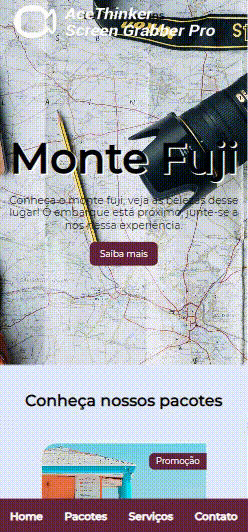

# Travel Agency Website
### Access the application: 🌐 [travel-agency-website.vercel.app/](travel-agency-website.vercel.app/)

 

Project developed with the aim of improving some skills in CSS.

In this project it was used:

- Flexbox concepts
    - We cover the basics of flexbox, such as: flex-direction, justify-content and align-items

- How to integrate with google maps
    - The contact section of the website uses a map to show the address, for this we use google maps integration and documentation.

- Media queries
    - The entire site is responsive for smartphones, tablets and desktops.

 

## 🖥️ Desktop Behavior

## 📱 Mobile Behavior

### 🗒 Notes
- [Notes](./anotacoes.md) made during the development of the project.